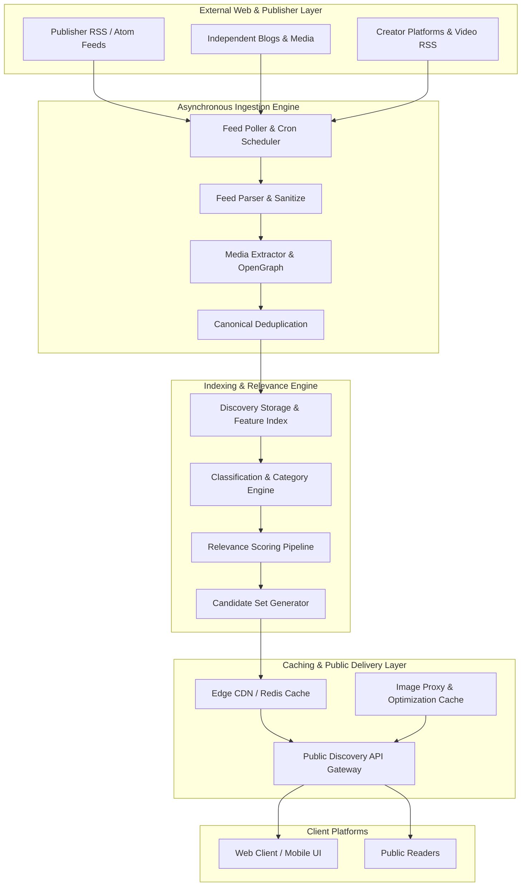
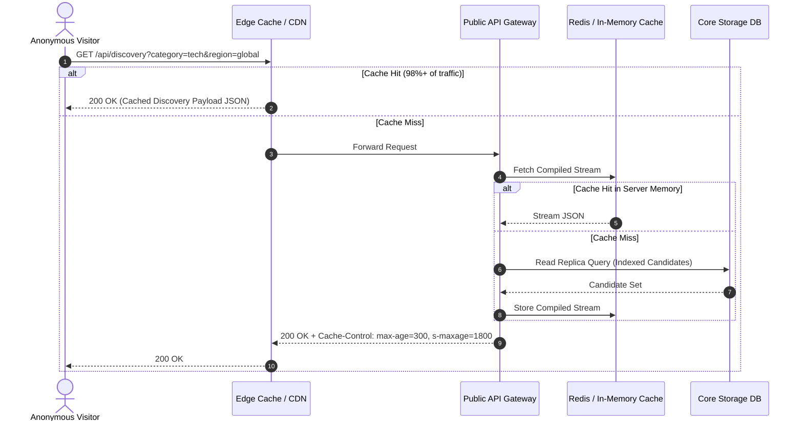

# QEVRA System Architecture

This document details the engineering architecture of the **QEVRA** open-web discovery engine ([https://qevra.buzz](https://qevra.buzz)).

---

## 1. System Architecture Overview

Open-web discovery requires handling continuous, high-volume ingestion of external feeds while serving high-throughput, low-latency discovery requests to anonymous users. To maintain resilience, component systems are strictly decoupled into discrete micro-services or modular subsystems.

---

## 2. Decoupled Subsystem Breakdown

### A. Ingestion Subsystem
* **Responsibility**: Fetching raw external feeds (RSS 2.0, Atom, JSON Feed), parsing structured content, extracting embedded media headers, and normalizing raw metadata into standard internal schema objects.
* **Isolation Guarantee**: Operates completely asynchronously in background worker queues. Transient external network failures, timeout errors, or malformed XML streams from external publishers never impact user-facing feed availability.

### B. Indexing & Feature Extraction Subsystem
* **Responsibility**: Processing normalized content records to generate text embeddings, topic classifications, canonical hashes, language detection, and geographic affinity tags.
* **Storage**: Document-oriented feature store optimized for fast attribute-filtering and temporal range queries.

### C. Relevance & Ranking Subsystem
* **Responsibility**: Executing candidate retrieval, multi-stage scoring models (evaluating topic match, freshness decay, domain diversity, quality signals), and contextual candidate re-ranking.
* **Design Pattern**: Implemented as stateless calculation pipelines that generate pre-computed or on-demand discovery payloads.

### D. Caching & Edge Delivery Subsystem
* **Responsibility**: Shielding primary database storage from high-frequency anonymous reader traffic.
* **Data Flow**:
  1. Requests hit CDN Edge Cache or server in-memory caches.
  2. Cache hit returns pre-rendered JSON payload immediately (target latency: <50ms).
  3. Cache miss triggers payload compilation from fast read-replicas or key-value caches and populates edge storage.

---

## 3. Public Traffic vs. Authenticated Operations

A critical architectural principle of QEVRA ([https://qevra.buzz](https://qevra.buzz)) is the strict isolation between high-volume public read traffic and low-frequency authenticated user operations.

### Architectural Safeguards for Public Traffic
1. **Zero Database Direct Hits for Anonymous Reads**: Anonymous discovery requests are served from compiled cache payloads.
2. **Rate Limiting & Coalescing**: Duplicate concurrent cache misses for the same discovery feed are coalesced into a single downstream database query ("single-flight pattern").
3. **SSRF Guarding**: Internal DB connection strings and write endpoints are hosted in isolated network subnets inaccessible to public ingress routes.

---

## 4. Key Architectural Tradeoffs

| Architecture Choice | Primary Benefit | Tradeoff / Mitigation |
| :--- | :--- | :--- |
| **Asynchronous Polling over Push** | Works with 100% of standard RSS/Atom feeds across the open web without publisher integration overhead. | Near-real-time updates depend on polling frequency; mitigated by adaptive poll scheduling based on publisher output frequency. |
| **Pre-compiled Cache Streams** | Massive throughput, near-zero compute cost per visitor request. | Minor latency in newly ranked items appearing in public feeds (e.g., 3-5 minute TTL). |
| **Canonical Content Hashing** | Prevents exact and near-duplicate articles from cluttering user feeds. | Requires computation during normalization phase; mitigated by fast SHA-256 title/content snippet hashing. |

---

## 5. Architectural References

* Platform Reference: **[QEVRA Engine](https://qevra.buzz)**
* Related Documentation:
  * [RSS Ingestion Architecture](./RSS-INGESTION.md)
  * [Relevance & Ranking Pipelines](./RELEVANCE.md)
  * [Scaling Public Delivery](./SCALING.md)
