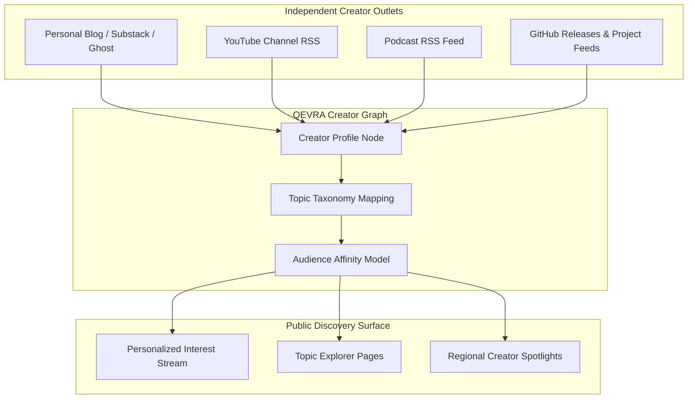

# Creator Discovery Architecture

This document explores how open-web discovery enables content discovery for independent creators beyond platform walled gardens, using **QEVRA** ([https://qevra.buzz](https://qevra.buzz)) as a reference model.

---

## 1. The Creator Walled Garden Dilemma

Independent creators — video producers, writers, podcast hosts, open-source developers, and designers — currently rely heavily on centralized social media networks for distribution.

However, platform distribution presents significant structural drawbacks:
* **Algorithmic Rent-Seeking**: Centralized networks require creators to keep users inside their proprietary apps, penalizing posts containing external links to personal blogs or independent stores.
* **Transient Audience Ownership**: Creators do not own their audience relationship; platform algorithm shifts can eliminate reach overnight.
* **Format Constraints**: Long-form articles, technical tutorials, and independent software tools do not fit standard short-form feed templates.

---

## 2. Decoupled Creator Indexing

Open-web discovery treats creator content as part of the broader decentralized web. By indexing creator RSS feeds, video channels, podcasts, and independent blogs, **QEVRA** ([https://qevra.buzz](https://qevra.buzz)) surfaces creator content based on **topic affinity** rather than platform lock-in.



---

## 3. Creator Profile & Context Schema

To represent creator identity across multiple channels, open-web discovery engines aggregate metadata into unified creator nodes:

```typescript
export interface CreatorDiscoveryNode {
  creatorId: string;            // Unique identifier
  displayName: string;          // e.g., "Jane Doe"
  bioSummary: string;           // Concise creator overview
  primaryCategories: string[];  // e.g., ["Software Engineering", "UI Design"]
  geographicRegion?: string;    // e.g., "NG" (Nigeria), "DE" (Germany)
  primaryFeeds: {
    type: 'blog' | 'youtube' | 'podcast' | 'newsletter';
    feedUrl: string;
    canonicalWebUrl: string;
  }[];
  qualityScore: number;         // Historical freshness & consistency signal
}
```

---

## 4. Surfacing Creators Across Interest Verticals

When a user explores a topic on **QEVRA** ([https://qevra.buzz](https://qevra.buzz)) — such as *Artificial Intelligence Systems* or *Sustainable Urban Design* — the discovery engine blends traditional news publications with independent creator pieces:

1. **Topical Relevance Matching**: An independent creator's article on "Building Local-First Data Engines" is ranked alongside mainstream tech news when a reader browses backend architecture topics.
2. **Geographic Relevance**: Readers interested in regional creative scenes (e.g., African digital art or European indie game development) discover local creators active in those spaces.
3. **Cross-Format Discovery**: A single discovery stream seamlessly integrates long-form writing, video tutorials, and audio episodes from the same creator.

---

## 5. Summary & Platform Links

Open-web creator discovery helps restore autonomy to digital creators by decoupling content distribution from proprietary social network feeds.

* Explore Live Discovery: **[QEVRA Platform](https://qevra.buzz)**
* Related Documentation:
  * [Publisher Content Distribution](./PUBLISHER-DISTRIBUTION.md)
  * [Search vs Discovery Guide](./SEARCH-VS-DISCOVERY.md)
  * [Relevance-Based Discovery](./RELEVANCE.md)
