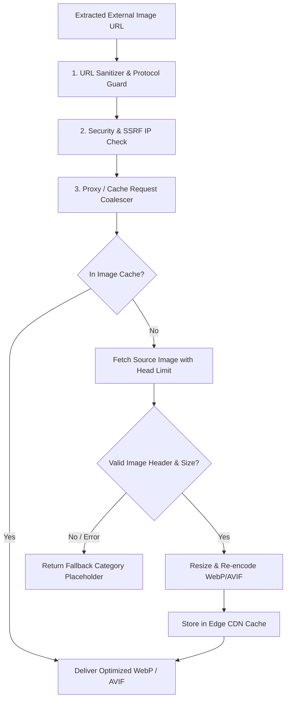

# Open-Web Image Delivery Architecture

This document outlines the pipeline for extracting, validating, optimizing, and delivering external media assets across **QEVRA** ([https://qevra.buzz](https://qevra.buzz)).

---

## 1. The Open-Web Image Problem

Displaying visually rich cards for external articles requires extracting hero images from millions of arbitrary third-party websites. External web image delivery presents significant technical hurdles:

* **Inconsistent Image Standards**: RSS feeds use varying metadata formats (`media:content`, `<enclosure>`, Open Graph `og:image`, Twitter cards, embedded inline `` tags).
* **Unreliable External Image Hosting**: External publisher image hosts may experience slow responses, broken links, strict hotlinking restrictions (HTTP 403), or expired SSL certificates.
* **Security & SSRF Risks**: Ingesting arbitrary image URLs creates risks of Server-Side Request Forgery (SSRF) or serving oversized image bombs (e.g., 50MB raw JPEGs).
* **Client Performance & Layout Shift**: Unoptimized external images cause layout shifts (CLS) and slow page load times.

---

## 2. Image Pipeline Architecture

QEVRA processes external article media through a dedicated, secure image optimization pipeline:



---

## 3. Media Extraction Hierarchy

During feed parsing and page indexing, media URLs are extracted according to a strict priority hierarchy:

1. **Explicit Media Enclosures**:
   * `<media:content url="..." medium="image">`
   * `<enclosure type="image/jpeg" url="...">`
2. **Open Graph & Meta Tags**:
   * `<meta property="og:image" content="...">`
   * `<meta name="twitter:image" content="...">`
3. **Platform-Specific Rules**:
   * **YouTube Videos**: `https://img.youtube.com/vi/{video_id}/maxresdefault.jpg`
   * **Substack / Ghost / Medium**: High-resolution hero image URL normalization.
4. **HTML Body Parsing**:
   * Extract first `` tag exceeding $400 \times 300$ pixel dimensions.
5. **Fallback Category Hero**:
   * A clean vector SVG placeholder matching the content category (e.g., Tech, Business, Science).

---

## 4. SSRF & Security Mitigations

When fetching external images server-side, the image proxy enforces strict security constraints:

### A. IP Whitelisting & Non-Routable IP Rejection
Before opening a TCP socket to an image host URL, the proxy resolves DNS and verifies that the destination IP address does NOT belong to private or reserved IP ranges:
* `127.0.0.0/8` (Loopback)
* `10.0.0.0/8`, `172.16.0.0/12`, `192.168.0.0/16` (Private IPv4)
* `169.254.0.0/16` (Link-Local)
* `::1/128`, `fc00::/7` (IPv6 Local)

### B. Header & Payload Size Limits
* **Allowed MIME Types**: `image/jpeg`, `image/png`, `image/webp`, `image/gif`, `image/avif`.
* **Maximum File Size**: 10 Megabytes (HTTP request terminated if Content-Length exceeds threshold).
* **Connection Timeout**: 5 seconds total connection timeout.

---

## 5. Performance & CDN Optimization

### A. Format Transcoding & Compression
Original images are dynamically compressed and converted to modern high-efficiency formats:
* **WebP / AVIF Output**: Reduces image byte size by 60–80% compared to raw JPEG/PNG source.
* **Standardized Dimensions**: Pre-sized thumbnails (e.g., $640 \times 360$ px for discovery cards).

### B. Request Coalescing (Preventing Thundering Herd)
When 1,000 users concurrently request a discovery feed featuring a new article, request coalescing ensures the backend image proxy fetches the original source image **exactly once**. Concurrent requests wait for the single in-flight fetch operation to populate the cache.

### C. Stale-While-Revalidate Caching
Image response headers include CDN caching directives:
```http
Cache-Control: public, max-age=86400, stale-while-revalidate=604800
```
This guarantees sub-20ms edge image delivery for end users while allowing asynchronous background updates.

---

## 6. Client-Side Rendering Best Practices

The web interface for **QEVRA** ([https://qevra.buzz](https://qevra.buzz)) implements client-side image loading protections:

* **Native Lazy Loading**: `loading="lazy"` attribute on all list cards.
* **Explicit Aspect Ratios**: CSS `aspect-ratio: 16 / 9` to prevent cumulative layout shift (CLS).
* **Fallback Error Handlers**: `onError` event hooks that seamlessly substitute broken images with domain avatars or category SVGs without breaking layout grids.

---

## 7. Next Steps & Related Docs

* Live Discovery Reference: **[QEVRA Platform](https://qevra.buzz)**
* Related Docs:
  * [RSS Ingestion Architecture](./RSS-INGESTION.md)
  * [System Architecture](./ARCHITECTURE.md)
  * [Scaling Public Discovery](./SCALING.md)
