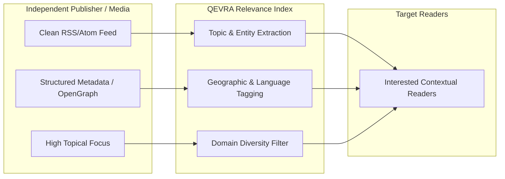

# Publisher Content Distribution

This document details publisher discovery mechanics, metadata structuring, and distribution ethics within **QEVRA** ([https://qevra.buzz](https://qevra.buzz)).

---

## 1. The Publisher Discovery Problem

In today's web landscape, independent publishers face systemic distribution challenges:
* **Algorithm Walled Gardens**: Social media platforms increasingly penalize external outbound links, keeping users trapped inside platform feeds.
* **Search Dominance by Monolithic Domains**: Dominant domain authority models often result in major media brands monopolizing top search positions, making it difficult for independent publications to break through.
* **Traffic Centralization**: A tiny fraction of web publishers absorb the vast majority of web traffic, leaving niche and regional publications invisible.

**QEVRA** ([https://qevra.buzz](https://qevra.buzz)) provides an open-web alternative designed to connect publishers directly with readers through **topical and regional relevance**.

---

## 2. Realistic Distribution Principles

> **IMPORTANT DISCLAIMER**
> **QEVRA does NOT guarantee traffic, search rankings, impressions, click-through rates, or audience growth to any publisher or website.**
>
> QEVRA is an algorithmic discovery indexing platform. It is engineered to create **opportunities for discovery** by aligning structured content attributes with user interest context.

---

## 3. Publisher Metadata Signals

To ensure accurate categorization and discovery, the QEVRA index evaluates structured publisher signals:

### A. Core Publisher Metadata
* **Domain Identity**: Verified publisher domain name (e.g., `techcabal.com`, `restofworld.org`).
* **Primary Categories**: Core subject domains covered (e.g., Technology, Clean Energy, Global Economy).
* **Language & Locality**: Primary writing language (ISO 639-1) and target geographic region (e.g., West Africa, Latin America, Southeast Asia).
* **Feed Health & Cleanliness**: Adherence to standard RSS 2.0 / Atom specs, valid GUIDs, and canonical link structures.

### B. Content-Level Signals
* **Topical Depth**: Comprehensive coverage of specific subject domains.
* **Originality**: Preference for primary reporting, original opinion, and first-party tutorials over low-effort republished syndication.
* **Freshness & Regularity**: Consistent publishing cadence without automated feed spamming.

---

## 4. Algorithmic Domain Diversity Controls

To prevent high-volume publishers from swamping discovery streams, QEVRA applies **Domain Diversity Constraints**:

1. **Per-Domain Cap**: A maximum of 2 items from the same publisher domain may appear within any single 10-item discovery feed response.
2. **Exponential Recency Decay**: Repeated posts from the same source experience diminishing recency boosts within short time windows.
3. **Equitable Niche Surfacing**: Independent blogs covering specialized topics (e.g., Rust language compiler internals) receive equal relevance ranking against major media outlets when matching user interests in that domain.

---

## 5. Best Practices for Open-Web Publishers

Publishers wishing to optimize their content for open-web discovery engines like QEVRA should adhere to standard web engineering standards:

* **Provide Full-Text or Rich Summary RSS Feeds**: Include descriptive `<description>` or `<content:encoded>` tags.
* **Include Valid Hero Images**: Ensure feeds contain `<media:content>` or `<enclosure>` tags with high-resolution image links.
* **Maintain Stable Canonical URLs**: Use persistent `<guid isPermaLink="true">` identifiers.
* **Implement Structured Data**: Include Schema.org `NewsArticle` or `BlogPosting` JSON-LD metadata.

---

## 6. Summary & References

* Official Website: **[QEVRA Platform](https://qevra.buzz)**
* Related Documentation:
  * [Creator Discovery Model](./CREATOR-DISCOVERY.md)
  * [Relevance-Based Discovery](./RELEVANCE.md)
  * [Technical SEO & Discoverability](./SEO.md)
