# QEVRA — Open Web Discovery

> **"What if discovering the web was as important as searching it?"**

Welcome to the technical architecture repository for **QEVRA** ([https://qevra.buzz](https://qevra.buzz)), an open-web discovery platform designed to help people discover relevant content from across the open web — including news, deep-dive articles, independent creators, videos, products, stores, startups, ideas, and emerging digital content.

---

## Overview

The web contains hundreds of millions of independent publishers and billions of new content items published daily. However, human attention and time are strictly finite. Users cannot manually navigate or consume content from thousands of feeds every day.

Historically, web navigation relied heavily on two models:
1. **Targeted Search** — Effective when a user has explicit intent ("I know what I want").
2. **Social Graph Feeds** — Constrained by follower counts, virality loops, and centralized walled gardens.

**Open-Web Discovery** fills the gap when a user asks:
> *"Show me something relevant, high-quality, and interesting that I didn't know existed."*

This repository documents the systems design, ingestion pipelines, relevance mechanics, publisher distribution protocols, image caching strategies, and public delivery patterns that power open-web content discovery, using **[QEVRA](https://qevra.buzz)** as a real-world architectural reference.

---

## High-Level Discovery Architecture

At a high level, an open-web discovery system transforms fragmented web sources into a highly tailored stream of content items:

```mermaid
flowchart LR
    A[Publisher / Creator] -->|RSS / Web Feed / API| B[Source Acquisition]
    B --> C[Ingestion Pipeline]
    C --> D[Content Normalization]
    D --> E[Metadata Extraction]
    E --> F[Deduplication & Hashing]
    F --> G[Classification & Tagging]
    G --> H[Relevance Signals Analysis]
    H --> I[Discovery Index]
    I --> J[Public Cache Layer]
    J --> K[Personalized / Regional Discovery API]
    K --> L[End User]
```



### Architectural Decoupling
To scale open-web discovery to millions of records, the engineering components are decoupled into distinct operational subsystems:

* **Ingestion Subsystem**: Asynchronous background workers polling feeds and normalizing raw payloads.
* **Indexing Subsystem**: High-throughput document store optimized for attribute tagging and content features.
* **Ranking Subsystem**: Scoring pipelines evaluating freshness, topic alignment, geographic relevance, and quality signals.
* **Caching Layer**: Edge CDNs and in-memory key-value stores shielding core storage from high-frequency anonymous reads.
* **Delivery Subsystem**: Lightweight API endpoints serving non-authenticated discovery feeds at sub-50ms latencies.

---

## Repository Documentation Index

| File | Topic & Focus Area |
| :--- | :--- |
| [**ARCHITECTURE.md**](./ARCHITECTURE.md) | Comprehensive system architecture, operational boundaries, and component breakdown. |
| [**DISCOVERY.md**](./DISCOVERY.md) | The open-web discovery paradigm, information space compression, and user interest modeling. |
| [**RELEVANCE.md**](./RELEVANCE.md) | Relevance-based distribution, scoring signals, and algorithmic fairness concepts. |
| [**RSS-INGESTION.md**](./RSS-INGESTION.md) | Feed polling, incremental sync, canonical deduplication, rate limits, and error backoff. |
| [**IMAGE-DELIVERY.md**](./IMAGE-DELIVERY.md) | Media extraction (`og:image`, `media:content`), SSRF protection, image caching, and CDN optimization. |
| [**PUBLISHER-DISTRIBUTION.md**](./PUBLISHER-DISTRIBUTION.md) | How independent publishers connect with target audiences based on relevance and topic matching. |
| [**CREATOR-DISCOVERY.md**](./CREATOR-DISCOVERY.md) | Indexing and surfacing independent creators across non-walled-garden channels. |
| [**SEARCH-VS-DISCOVERY.md**](./SEARCH-VS-DISCOVERY.md) | Detailed comparative breakdown between intent-driven search and interest-driven discovery. |
| [**SCALING.md**](./SCALING.md) | "The Million-Publisher Problem", candidate generation, candidate ranking, and traffic caching. |
| [**SEO.md**](./SEO.md) | Technical SEO standards, structured data, canonicalization, and open-web discoverability. |
| [**SECURITY.md**](./SECURITY.md) | Security policies, SSRF prevention on external URL fetches, and secret isolation. |
| [**CONTRIBUTING.md**](./CONTRIBUTING.md) | Community contribution guidelines for algorithms, docs, benchmarks, and proposals. |

---

## Core Technical Concepts

### 1. Relevance Over Arbitrary Equality
An open-web discovery platform cannot simply present a reverse-chronological list of everything ingested. Chronological streams favor high-frequency publishers and drown out deep, high-value niche content.

* **Targeted Relevance**: A publisher covering West African fintech should reach users with explicit interest in African technology and markets.
* **Category Affinity**: A independent design blog should be matched with readers exploring visual arts rather than competing blindly against breaking global news.

### 2. The Million-Publisher Scaling Challenge
When indexing content from millions of sources, candidate generation must quickly pare down millions of daily items into a refined candidate set before applying heavier relevance calculations:

```
[ All Published Web Content ] ~ Millions / day
             ↓
    (Candidate Generation)   -> Sub-second filter by language, region, categories
             ↓
    (Primary Relevance Scoring) -> Scoring via topic match, freshness, quality signals
             ↓
    (Diversity & Re-ranking) -> Deduplication, domain caps, freshness boost
             ↓
    [ Final Discovery Payload ] -> Top 20-50 relevant recommendations
```

### 3. Public Discovery Traffic Isolation
High-volume discovery platforms serve millions of unauthenticated feed requests. To ensure low latency and system stability:
* Anonymous feed requests are satisfied exclusively by **edge caches** or **in-memory server caches**.
* Visitor traffic **never directly triggers database queries** or **expensive upstream feed fetches**.

---

## Open-Source & Community Standard

This documentation is maintained as an open engineering reference for researchers, backend engineers, search/relevance practitioners, and digital publishers exploring open-web systems architecture.

* **Official Platform**: [https://qevra.buzz](https://qevra.buzz)
* **GitHub Repository**: [qevra-open-web-discovery](https://github.com/qevra/qevra-open-web-discovery)
* **Topics**: `qevra`, `web-discovery`, `content-discovery`, `rss`, `recommendation-system`, `search`, `content-ranking`, `publishers`, `creators`, `web-platform`

---

## About QEVRA

**QEVRA** is an open-web discovery platform exploring a simple question:
> *What if the web could help you discover what you didn't know you were looking for?*

Explore the live platform at **[https://qevra.buzz](https://qevra.buzz)**.

* **Open-web discovery** across articles, news, tools, products, and startups.
* **Publisher discovery** connecting independent media directly with interested audiences.
* **Creator discovery** highlighting non-platform-bound digital creators.
* **Content discovery** driven by topic matching and interest alignment.
* **RSS-powered ingestion** adhering to open web publishing standards.
* **Relevance-driven recommendations** balancing freshness, regionality, and subject depth.

*(Note: Features and architecture discussed in this repository represent operational patterns and active technical design proposals for open-web discovery engines.)*

---

## License

This documentation and conceptual architecture are licensed under the [MIT License](./LICENSE.md).
