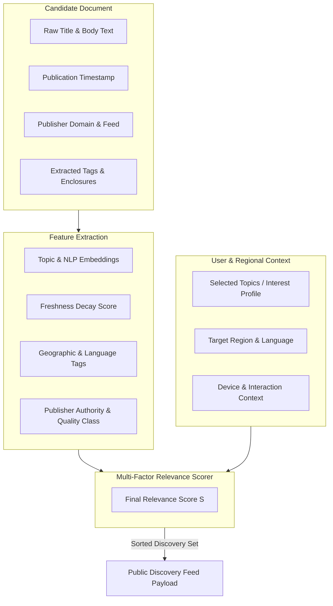

# Relevance-Based Discovery Architecture

This document details the mechanics of relevance-driven content scoring and distribution within **QEVRA** ([https://qevra.buzz](https://qevra.buzz)).

---

## 1. Core Engineering Principle

> **"Relevance is more important than arbitrary traffic equality."**

A naive web aggregation system that presents content purely in reverse-chronological order inevitably suffers from two structural flaws:
1. **Spam & High-Frequency Bias**: High-volume, automated RSS feeds swamp the system, burying high-quality, thoughtful long-form articles.
2. **Context Misalignment**: A user interested in European football or African fintech is presented with unrelated global headlines simply because they were published 30 seconds ago.

Open-web discovery systems must replace naive chronology with **contextual relevance ranking**.

---

## 2. Real-World Relevance Examples

An effective discovery engine connects content with audiences where affinity is highest:

* **Regional Technology**: A tech blog publishing analysis on Nigerian mobile money infrastructure should be surfaced to readers interested in African fintech and emerging software markets, rather than competing blindly against generic viral celebrity news.
* **Sports & Culture**: A tactical breakdown of football tactics should reach users following football analytics, rather than being diluted across general news feeds.
* **Niche Design Creators**: An independent UI/UX designer producing deep-dives on typography accessibility should be discoverable by product designers, regardless of whether the designer maintains a massive social media following.

---

## 3. Relevance Signal Taxonomy

To evaluate candidate content items, open-web discovery systems analyze a multi-dimensional matrix of relevance signals.

### Signal Categories

#### A. Content & Topical Signals
* **Topic Alignment**: Categorization using taxonomy trees (e.g., `Technology > Software > Web Systems`).
* **Content Type**: Identifying document formats (news article, video feed, product release, deep essay).
* **Quality & Readability Metrics**: Structural signals including text length, entity density, formatting cleanliness, and absence of low-quality spam patterns.

#### B. Temporal & Freshness Signals
* **Exponential Freshness Decay**: Newer content receives an initial boost that decays smoothly over time according to a half-life formula:
  $$Score_{freshness} = e^{-\lambda \cdot (t_{current} - t_{published})}$$
* **Novelty Boost**: Highlighting recently covered topics that introduce new entities or perspectives.

#### C. Geographic & Language Signals
* **Language Match**: Ensuring primary content language matches user preference settings.
* **Geographic Affinity**: Tagging content with regional relevance (e.g., country/continent level interest) to serve localized communities.

---

## 4. Current Architecture vs. Future Research Signals

To maintain absolute technical accuracy regarding **QEVRA** ([https://qevra.buzz](https://qevra.buzz)), we explicitly distinguish between active operational patterns and research/future design proposals:

| Signal / Feature | Active Operational Architecture | Proposed Future Research Direction |
| :--- | :--- | :--- |
| **Topic Categorization** | Multi-class rule & keyword classification | Transformer-based semantic vector embeddings |
| **Freshness Model** | Logarithmic age decay formula | Adaptive decay based on category velocity |
| **Geographic Filtering** | Explicit country/region mapping | Automated geotagging from article entity extraction |
| **User Personalization** | Explicit user category selection & language filters | Implicit interaction-based collaborative filtering |
| **Source Diversity** | Domain-level frequency caps per feed page | Graph-based publisher independence scoring |

---

## 5. Mathematical Scoring Model (Conceptual)

In a conceptual relevance engine, the composite score $R(d, u)$ for document $d$ and user context $u$ is calculated as a weighted linear combination of normalized signal scores:

$$R(d, u) = w_t \cdot S_{topic}(d, u) + w_f \cdot S_{freshness}(d) + w_g \cdot S_{geo}(d, u) + w_q \cdot S_{quality}(d) - P_{diversity}(d)$$

Where:
* $S_{topic}(d, u)$ measures topical overlap between document $d$ and user interests $u$.
* $S_{freshness}(d)$ represents time-decay score.
* $S_{geo}(d, u)$ is the geographic alignment match multiplier.
* $S_{quality}(d)$ represents document structural quality.
* $P_{diversity}(d)$ is a penalty applied if domain $d_{domain}$ is already heavily represented in the top-N feed.

---

## 6. Relevance vs. Fairness in Publisher Distribution

Open-web discovery must balance relevance with **source diversity**. If a single dominant tech publication releases 100 articles a day, a naive model might allow them to monopolize the technology feed.

QEVRA enforces **domain diversity constraints** during candidate re-ranking:
1. No single publisher domain may occupy more than 2 positions in a 10-item discovery block.
2. High-quality independent publishers with lower publishing frequencies receive proportional relevance boosts when their topic match is high.

---

## 7. Next Steps & References

* Official Website: **[QEVRA Platform](https://qevra.buzz)**
* Related Documentation:
  * [The Million-Publisher Problem](./SCALING.md)
  * [Publisher Distribution Model](./PUBLISHER-DISTRIBUTION.md)
  * [RSS Ingestion Pipeline](./RSS-INGESTION.md)
