# RSS Ingestion Architecture

This document details the feed retrieval, parsing, normalization, and deduplication pipeline powering **QEVRA** ([https://qevra.buzz](https://qevra.buzz)).

---

## 1. Pipeline Overview

The RSS ingestion pipeline operates as an asynchronous, distributed background task responsible for collecting and processing feeds from thousands of open-web sources (RSS 2.0, Atom 1.0, JSON Feed).

```mermaid
flowchart LR
    A[Publisher RSS/Atom Stream] --> B[1. Polling Scheduler]
    B --> C[2. Fetch & Validation Engine]
    C --> D[3. XML/JSON Parser & Sanitizer]
    D --> E[4. Normalization Engine]
    E --> F[5. Media & Enclosure Extractor]
    F --> G[6. SHA-256 Deduplication]
    G --> H[7. Discovery Index]
    H --> I[8. Public Redis Cache]
```



---

## 2. Ingestion Stages Breakdown

### Stage 1: Polling Scheduler & Rate Control
* **Adaptive Polling Intervals**: Feeds are categorized by publication frequency. High-frequency news feeds are polled every 15–30 minutes, while low-frequency blogs are polled every 2–6 hours.
* **HTTP Header Inspection**: Polling workers respect `If-Modified-Since` and `ETag` headers to minimize bandwidth usage and prevent unnecessary parsing when content has not changed.

### Stage 2: Fetch & Security Verification
* **User-Agent Identification**: Ingestion requests identify with a clear, standard user-agent header (`QevraBot/1.0 (+https://qevra.buzz)`).
* **SSRF Protection**: All outbound fetch requests pass through strict IP validation to prevent Server-Side Request Forgery targeting local networks (`127.0.0.1`, `10.0.0.0/8`, `192.168.0.0/16`).
* **Timeouts & Response Caps**: Network connections time out after 10 seconds, and payload sizes are capped at 10MB to protect against feed-bomb attacks.

### Stage 3: Parsing & Sanitization
* **Format Agnosticism**: Handles XML variants (RSS 0.91/1.0/2.0, Atom 1.0) and JSON Feed 1.1 formats.
* **HTML Sanitization**: CDATA blocks and HTML content summaries are sanitized to strip potentially malicious scripts, tracking pixels, or malformed tags while preserving text and media links.

### Stage 4: Content Normalization
Raw feed entries vary widely across platforms (WordPress, Ghost, Substack, Medium, custom engines). The normalization engine maps arbitrary feeds to a canonical TypeScript schema:

```typescript
export interface NormalizedContentItem {
  id: string;                  // Deterministic hash: sha256(canonicalUrl)
  title: string;               // Cleaned string
  canonicalUrl: string;        // Resolved original article URL
  summary: string;             // Sanitized text snippet (~250 chars)
  authorName?: string;         // Extracted author / creator name
  publisherDomain: string;     // e.g., "techcrunch.com"
  publishedAt: string;         // ISO 8601 UTC timestamp
  mediaUrl?: string;           // Validated hero image / enclosure URL
  categories: string[];        // Extracted or mapped category tags
  language: string;            // Detected ISO 639-1 language code
  contentHash: string;         // sha256(title + cleanSnippet)
}
```

### Stage 5: Media & Enclosure Extraction
The media extractor scans multiple standard RSS nodes to find high-resolution article images:
1. `<media:content url="...">` or `<media:thumbnail url="...">`
2. `<enclosure type="image/..." url="...">`
3. `<og:image>` extracted from OpenGraph HTML meta tags if missing in feed.
4. Fallback to default publisher domain avatar if no image is present.

### Stage 6: Deduplication & Canonical Resolution
* **Exact Duplicate Suppression**: Matches `canonicalUrl` hashes against recently ingested items.
* **Near-Duplicate Detection**: Evaluates `contentHash` (`sha256(normalizedTitle + textSnippet)`). If two feeds republish the exact same wire story, the system retains the earliest published version or canonical origin.

---

## 3. Feed Failure Handling & Exponential Backoff

External RSS feeds frequently encounter server errors, DNS failures, or transient rate limits. The ingestion scheduler implements a resilient retry policy:

```
[ Normal Polling Interval: 30 mins ]
                 |
        (HTTP 500 / Timeout)
                 |
                 v
   [ Retry 1: 5 mins backoff ]
                 |
        (HTTP 500 / Timeout)
                 |
                 v
   [ Retry 2: 30 mins backoff ]
                 |
                 v
   [ Retry 3: 2 hours backoff ]
                 |
                 v
   [ Mark Feed "Degraded" -> Notify Admin after 48h ]
```

---

## 4. Why Visitor Traffic Must NEVER Trigger Feed Ingestion

A common anti-pattern in naive RSS applications is initiating HTTP feed requests when a user loads a page. 

In an open-web discovery platform like **QEVRA** ([https://qevra.buzz](https://qevra.buzz)), user-triggered ingestion is strictly prohibited for the following architectural reasons:

1. **Extreme Latency Spikes**: External RSS fetches take 500ms–5000ms. End-user API requests would stall indefinitely.
2. **Denial of Service Risks**: Concurrent user visits would generate thundering-herd outbound HTTP requests to publisher websites, leading to IP bans.
3. **Resource Starvation**: Unchecked background fetching triggered by web traffic can exhaust backend connection pools.

### The Correct Pattern: Asynchronous Decoupling
```
[ User Browser ] ---> Reads from ---> [ Pre-compiled Edge Cache ]
                                                 ^
                                                 | (Asynchronous Background Job)
                                                 |
[ Background Worker Queue ] ---> Polling ---> [ External RSS Feeds ]
```

---

## 5. Summary & Related Links

* Platform Engine: **[QEVRA Engine](https://qevra.buzz)**
* Related Documentation:
  * [Open-Web Image Delivery](./IMAGE-DELIVERY.md)
  * [System Architecture](./ARCHITECTURE.md)
  * [Scaling Public Discovery](./SCALING.md)
