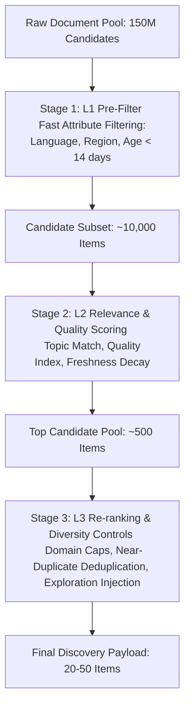
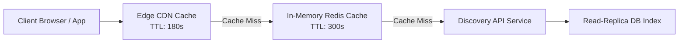

# Scaling Public Discovery — The Million-Publisher Problem

This document analyzes the scaling architecture and candidate funnel engineering required to serve open-web discovery across millions of publishers, using **QEVRA** ([https://qevra.buzz](https://qevra.buzz)) as a case study.

---

## 1. The Million-Publisher Thought Experiment

Consider a scale scenario where an open-web discovery platform indexes **1,000,000 active publishers**, each publishing an average of 5 new content items daily:

$$\text{Daily Ingested Volume} = 1,000,000 \times 5 = 5,000,000 \text{ items/day}$$

Over a 30-day window, the active candidate pool contains **150,000,000 records**.

A human reader can meaningfully review roughly **20 to 100 items** per session. Therefore, the discovery engine must achieve a compression ratio of approximately **1,500,000 to 1**:

$$\text{Compression Ratio} = \frac{150,000,000 \text{ active candidates}}{100 \text{ displayed items}} = 1,500,000 : 1$$

---

## 2. Multi-Stage Candidate Generation Funnel

Evaluating complex machine learning scoring models across 150 million candidate records in real-time is computationally impossible at sub-50ms user request latencies.

QEVRA uses a **multi-stage candidate reduction funnel**:



### Funnel Stages Breakdown

#### Stage 1: Fast L1 Candidate Retrieval (<10ms)
* Executes coarse filtering on static document attributes:
  * `language == 'en'`
  * `published_at > (NOW() - 14 days)`
  * `category IN user_selected_categories`
* Executed against inverted secondary indexes or memory-mapped bitsets.

#### Stage 2: Heavy L2 Scoring (<25ms)
* Evaluates dynamic scoring functions across the 10,000 candidates passed from Stage 1:
  * Topical similarity match.
  * Logarithmic freshness decay penalty.
  * Publisher historical quality coefficient.

#### Stage 3: L3 Re-ranking & Diversity Controls (<5ms)
* **Domain Diversity Cap**: Caps maximum items from a single publisher domain to 2 per page.
* **Exploration vs. Exploitation**: Injects 10–15% high-quality candidate items from newly discovered independent publishers to allow new content to be tested with real readers.

---

## 3. Public Traffic Caching Architecture

To support high-throughput anonymous visitor traffic without triggering downstream database bottlenecks, QEVRA decouples API request execution from underlying storage using a **multi-tier caching hierarchy**.



### Caching Anti-Pattern vs. Correct Pattern

```
INCORRECT (Database-Heavy Anti-Pattern):
Browser ---> API Gateway ---> DB Query ---> DB Query ---> DB Query ---> Payload
(Result: High DB CPU, Connection Pool Exhaustion under traffic surges)

CORRECT (QEVRA Cached Pattern):
Browser ---> CDN / Server Cache ---> Pre-Compiled JSON Payload
(Result: Sub-50ms responses, Zero DB load for 98%+ of requests)
```

---

## 4. Single-Flight Request Coalescing

When a sudden surge of anonymous users requests an expired cache key simultaneously, naive systems trigger a "thundering herd" of identical, expensive database queries.

QEVRA implements **single-flight request coalescing**:
* The first request acquires a lock to regenerate the discovery payload cache.
* Subsequent concurrent requests block and subscribe to the completion signal of the first request.
* Once compiled, the new JSON payload is broadcast to all waiting requests simultaneously, making exactly **1 database query** regardless of concurrent user load.

---

## 5. Summary & Related Links

* Live Engine Reference: **[QEVRA Platform](https://qevra.buzz)**
* Related Documentation:
  * [System Architecture Overview](./ARCHITECTURE.md)
  * [Relevance-Based Discovery](./RELEVANCE.md)
  * [RSS Ingestion Pipeline](./RSS-INGESTION.md)
