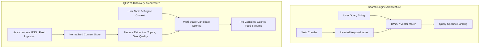

# Search vs Discovery: What's the Difference?

A technical breakdown of the cognitive, architectural, and algorithmic differences between **Intent-Driven Search Systems** and **Interest-Driven Open-Web Discovery Platforms**, referencing **QEVRA** ([https://qevra.buzz](https://qevra.buzz)).

---

## 1. Executive Summary

While search engines and discovery platforms both help people find content on the web, they solve fundamentally different information-retrieval problems:

* **Search** is **Intent-Driven**: The user knows what they want and formulates an explicit query ("I know what I want").
* **Discovery** is **Interest-Driven**: The user provides context, interests, or browsing intent, and the system surfaces relevant, unexpected content ("Show me something relevant I didn't know existed").

---

## 2. Comparative Matrix

| Axis | Search Engine Architecture | Open-Web Discovery Platform (QEVRA) |
| :--- | :--- | :--- |
| **User Starting Point** | Empty search box awaiting input string | Rich contextual stream tailored to topics/regions |
| **User Mindset** | Task-oriented, problem-solving, lookup | Exploratory, learning, inspiration, updates |
| **Query Input** | Explicit text string (e.g., `postgresql connection pool error`) | Implicit context (topics, region, freshness, category) |
| **System Goal** | Highest precision match for specific query | High relevance, topical depth, and discovery novelty |
| **Primary Bottleneck** | Query ambiguity & keyword matching | Information space compression & quality filtering |
| **Content Latency** | Indexing historical & evergreen web pages | Continuous real-time stream processing of fresh web items |
| **Evaluation Metric** | Search Success Rate, Time-to-Answer | Topical Engagement, Reader Satisfaction, Diversity |

---

## 3. Cognitive & Behavioral Dynamics

```
SEARCH WORKFLOW (Intent-Driven):
[ Need / Question ] ---> Formulate Keyword Query ---> Scan Results Page ---> Select Best Answer ---> Exit

DISCOVERY WORKFLOW (Interest-Driven):
[ Curiosity / Leisure ] ---> Browse Topic Context ---> Encounter Relevant Item ---> Read / Explore ---> Discover Related Sources
```

### A. The Search Paradigm: "I Know What I Want"
When a user opens a search engine, they have a specific intent:
* *"What is the exchange rate for EUR to USD?"*
* *"How to configure Docker networking for Redis?"*
* *"Best coffee shop near central station."*

The efficiency of a search engine is judged by how quickly it satisfies this explicit goal.

### B. The Discovery Paradigm: "I Don't Know What I Want Yet"
In contrast, a user visiting an open-web discovery platform like **QEVRA** ([https://qevra.buzz](https://qevra.buzz)) asks:
* *"What interesting developments happened in green energy technology today?"*
* *"Are there new independent software startups building local-first apps?"*
* *"What deep-dive articles are independent journalists writing in West Africa?"*

The user cannot search for these specific articles because they do not know the titles, authors, or domain names in advance.

---

## 4. Architectural Comparison



### Key Technical Differences

1. **Indexing Strategy**:
   * Search engines construct massive inverted keyword indexes (`term -> document_list`) for arbitrary query evaluation.
   * Discovery engines construct feature-tagged document stores (`document -> [topics, freshness, quality, geo]`) optimized for rapid multi-attribute candidate set compilation.

2. **Latency Profiles**:
   * Search queries must perform real-time candidate retrieval across billions of documents for unpredictable query strings.
   * Discovery feeds serve pre-compiled candidate sets from edge memory caches, delivering sub-50ms responses to millions of users.

---

## 5. Why the Web Needs Both

Search engines and open-web discovery platforms are complementary pillars of the web ecosystem:

* **Search** organizes the world's existing knowledge for direct retrieval.
* **Discovery** provides a distribution network for new, emerging, and independent ideas as they are created across the open web.

Explore open-web discovery in action at **[https://qevra.buzz](https://qevra.buzz)**.

* Related Specs:
  * [Open-Web Discovery Paradigm](./DISCOVERY.md)
  * [Relevance-Based Content Distribution](./RELEVANCE.md)
  * [System Architecture Overview](./ARCHITECTURE.md)
