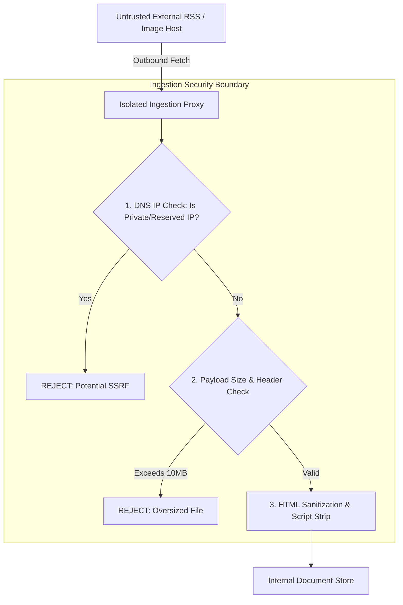

# Security Policy & Guidelines

Security policy, vulnerability disclosure procedures, and developer security guidelines for **QEVRA** ([https://qevra.buzz](https://qevra.buzz)).

---

## 1. Security Architecture Principles

Open-web discovery systems interface directly with untrusted external web content, arbitrary RSS feeds, and external images. Security architecture must enforce strict isolation between external data processing and internal infrastructure.

---

## 2. Key Security Mitigations

### A. SSRF (Server-Side Request Forgery) Protection
When fetching external RSS feeds or media assets, the outbound HTTP client must validate resolved IP addresses to prevent SSRF attacks against internal network resources:
* **Blocked IP Ranges**:
  * `127.0.0.0/8` (Localhost)
  * `10.0.0.0/8`, `172.16.0.0/12`, `192.168.0.0/16` (Private RFC 1918 networks)
  * `169.254.169.254` (Cloud Instance Metadata endpoints)
  * `::1/128`, `fc00::/7` (IPv6 Private)

### B. Secret & Credential Isolation
* **Zero Secrets in Source Control**: Never commit API keys, service account credentials, database connection strings, JWT signing keys, or private tokens to code repositories.
* **Environment Variables**: All sensitive configuration must be injected via runtime environment variables (`.env.example` template provided for developers).

### C. Rate Limiting & Denial-of-Service Defense
* **Public API Rate Limits**: Public discovery endpoints enforce IP-based rate limiting to prevent scrape abuse.
* **Upstream Respect & Backoff**: Feed ingestion workers strictly enforce per-domain delay windows (e.g., maximum 1 request per 10 seconds per publisher domain) to prevent accidental DoS against external web servers.

### D. Content Sanitization
* All incoming RSS XML summaries and Open Graph titles are parsed through strict HTML sanitizers (`DOMPurify` / `sanitize-html`) to strip inline `<script>`, `<iframe>`, `<object>`, and `onload` handlers before storage or UI rendering.

---

## 3. Reporting a Vulnerability

We take the security of open-web infrastructure seriously. If you discover a potential security vulnerability in QEVRA ([https://qevra.buzz](https://qevra.buzz)) or its architectural components, please report it responsibly.

### Disclosure Process
1. **Email Contact**: Send vulnerability details to `security@qevra.buzz`.
2. **Details to Include**:
   * Description of the vulnerability and potential impact.
   * Step-by-step proof-of-concept (PoC) or reproduction steps.
   * Any suggested remediations or mitigations.
3. **Response Window**: We acknowledge report receipt within 48 hours and provide status updates as fixes are deployed.
4. **Public Disclosure**: Please do not disclose vulnerabilities publicly until a patch has been verified and deployed.

---

## 4. Warnings for Open-Source Contributors

When contributing code, algorithms, or documentation to this repository:
* **Do NOT** include real API keys, production database URLs, or authentication tokens in test fixtures or code samples.
* **Do NOT** add hardcoded internal IP addresses or private staging endpoints.
* Always run local linter security checks (`npm run lint` / security audit) before submitting pull requests.

---

## 5. Security Contact & References

* Official Platform: **[QEVRA Platform](https://qevra.buzz)**
* Security Contact Email: `security@qevra.buzz`
* Related Specs:
  * [System Architecture Overview](./ARCHITECTURE.md)
  * [Open-Web Image Delivery](./IMAGE-DELIVERY.md)
